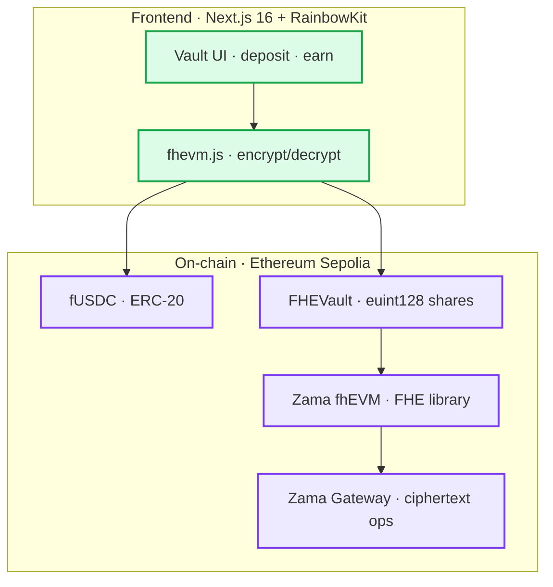

# zMAAI — Confidential Yield Vault via Zama FHE

*Privacy-preserving yield aggregator powered by Fully Homomorphic Encryption on Ethereum Sepolia.*

[](https://iex-ai.vercel.app)
[](https://zama.ai)
[](https://sepolia.etherscan.io/address/0x44b99f76f12e0Ece22f6bD76DcB305Afcf25876D)
[](LICENSE)

---

## Overview

**zMAAI** is a confidential yield vault aggregator where deposit amounts are encrypted on-chain using Zama's fhEVM protocol. Users deposit into vaults built with FHE (Fully Homomorphic Encryption) — balances and transactions remain private while vault TVL stays publicly verifiable.

- **Privacy by design** — per-depositor amounts encrypted on-chain via `euint128`
- **No trusted third party** — FHE allows computation on encrypted data without decryption
- **Live TVL** — aggregate vault balance publicly readable; individual deposits hidden
- **Zama fhEVM** — deployed on Ethereum Sepolia testnet

---

## Live on Ethereum Sepolia

| Contract | Address | Etherscan |
|---|---|---|
| **fUSDC** (ERC-20) | `0x3c13BDd505DE69bB0DF0a2e68A0Cd93a44beB0b4` | [view](https://sepolia.etherscan.io/address/0x3c13BDd505DE69bB0DF0a2e68A0Cd93a44beB0b4#code) |
| **FHEVault** | `0x3152B6f625F25B6a2Aa0Adb57017eB74acA65ecB` | [view](https://sepolia.etherscan.io/address/0x3152B6f625F25B6a2Aa0Adb57017eB74acA65ecB#code) |

---

## Architecture



### How FHE Privacy Works

1. **Deposit** — user enters amount, frontend encrypts via `fhevm.js`, sends `bytes32` ciphertext to vault
2. **On-chain** — vault stores `euint128` encrypted shares; operations (`add`, `sub`, `ge`) run on ciphertexts
3. **Verify TVL** — anyone can call `getTotalAssets()` which returns the encrypted aggregate
4. **Withdraw** — shares decrypted only by the owner (via Zama gateway); vault never sees plaintext

---

## Smart Contracts (`/contracts`)

Built with **Foundry** + **Zama fhEVM**.

| File | Description |
|---|---|
| `FHEUSDC.sol` | ERC-20 mintable token (6 decimals) |
| `FHEVault.sol` | ERC-20 vault with `euint128` encrypted shares using `FHE` library |
| `DeployFHEVaults.s.sol` | Deployment script to Sepolia |

**Tech stack:**
- Solidity `^0.8.24`
- [Zama fhEVM](https://github.com/zama-ai/fhevm) — `FHE.sol`, encrypted types (`euint128`, `ebool`)
- OpenZeppelin v5
- Foundry (forge, cast)

---

## Frontend (`/src`)

- **Next.js 16** (App Router) + React 19
- **RainbowKit 2.2** + Wagmi 2.19 + Viem 2.48
- **fhevm.js** — client-side encryption/decryption
- **Tailwind CSS v4** + Framer Motion + lucide-react
- **Zustand** for deposit flow state

### Key Files

| Path | Description |
|---|---|
| `lib/zama-sdk.ts` | FHE ABI, contract addresses, helpers |
| `stores/zama-deposit-store.ts` | 4-step deposit flow (approve → deposit) |
| `components/pages/(app)/earn/zama-deposit-sheet/` | Deposit modal with FHE flow |
| `app/api/zama/vaults/` | Zama vault API route |

---

## Getting Started

### Prerequisites

- Node.js ≥ 20, pnpm ≥ 9
- [Foundry](https://book.getfoundry.sh/) (`forge`, `cast`)
- Ethereum Sepolia ETH (faucet: https://www.alchemy.com/faucet/ethereum)

### 1. Clone & Install

```bash
git clone https://github.com/maulana-tech/iEx-ai.git
cd iEx-ai
cp .env.example .env.local
pnpm install
```

### 2. Smart Contracts

```bash
cd contracts
cp .env.example .env
# Fill in PRIVATE_KEY
forge build
```

### 3. Deploy to Sepolia

```bash
cd contracts
forge script script/DeployFHEVaults.s.sol \
  --rpc-url https://ethereum-sepolia-rpc.publicnode.com \
  --broadcast
```

Output: `fUSDC` and `FHEVault` addresses. Update `src/lib/zama-sdk.ts` if changed.

### 4. Run Frontend

```bash
pnpm dev
# → http://localhost:3000
```

### 5. End-to-End

1. Connect wallet (auto-prompts Sepolia switch)
2. Go to **/earn** → enter fUSDC amount
3. Click **Deposit** → approve + deposit (amount encrypted on-chain)
4. Vault TVL publicly readable; your balance encrypted

---

## Threat Model

| Adversary | Can See | Cannot See |
|---|---|---|
| On-chain observer | Vault TVL, contract code | Per-depositor amounts |
| Other depositors | Nothing about others' balances | — |
| zMAAI team | Frontend only | Any on-chain state |
| Zama gateway operator | Ciphertexts only | Plaintext amounts |

---

## Tech Stack

```
Smart Contracts  ┃ Solidity ^0.8.24, Foundry, Zama fhEVM (FHE library)
Privacy          ┃ Fully Homomorphic Encryption (euint128 encrypted shares)
Frontend         ┃ Next.js 16, React 19, RainbowKit, Wagmi, Viem, Tailwind v4
State            ┃ Zustand (client) + TanStack Query (server)
Network          ┃ Ethereum Sepolia (chain id 11155111)
```

---

## License

MIT © 2026 zMAAI contributors. See [LICENSE](LICENSE).